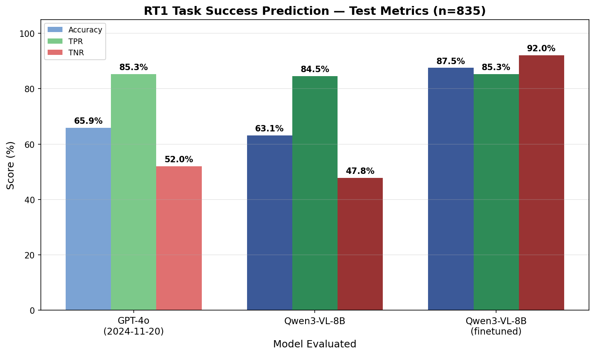

# WorldEvals

## Description

This repo replicates and improves the results of the VLM judge in the [WorldGym paper](https://arxiv.org/abs/2506.00613). 

I finetuned Qwen3-VL-8b with TRL to more effectively classify whether the videos in the [RT-1 dataset](https://robotics-transformer1.github.io/) succesfully completed the task action. Intsead of passing in the full video, I extracted the first, last, and two middle frames of the video to send the model 4 different images. The total training set has 3,319 samples and the test set has 835 samples.

The finetuned model can be found on Hugging Face at: 

## Eval Results (n=835)

| Model | Accuracy | TPR | TNR | FPR | FNR |
|---|---|---|---|---|---|
| GPT-4o (2024-11-20) | 65.9% | 85.3% | 52.0% | 48.0% | 14.7% |
| Qwen3-VL-8B (base) | 63.1% | 84.5% | 47.8% | 52.2% | 15.5% |
| Qwen3-VL-8B (finetuned) | **87.5%** | **85.3%** | **92.0%** | **8.0%** | **14.7%** |

| Finetuned delta | vs GPT-4o | vs Base |
|---|---|---|
| Accuracy | +21.6% | +24.4% |
| TPR | +0.0% | +0.8% |
| TNR | +40.0% | +44.2% |

